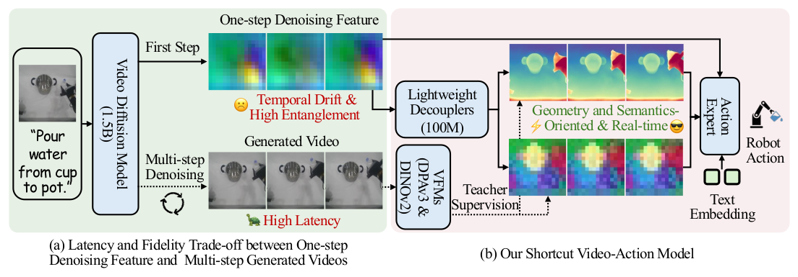
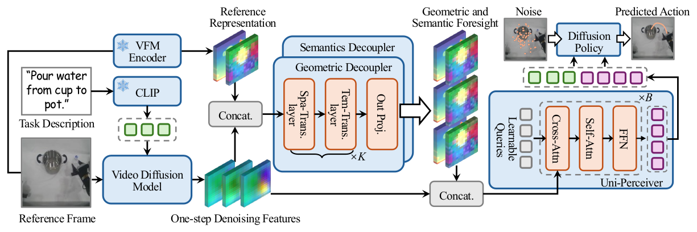
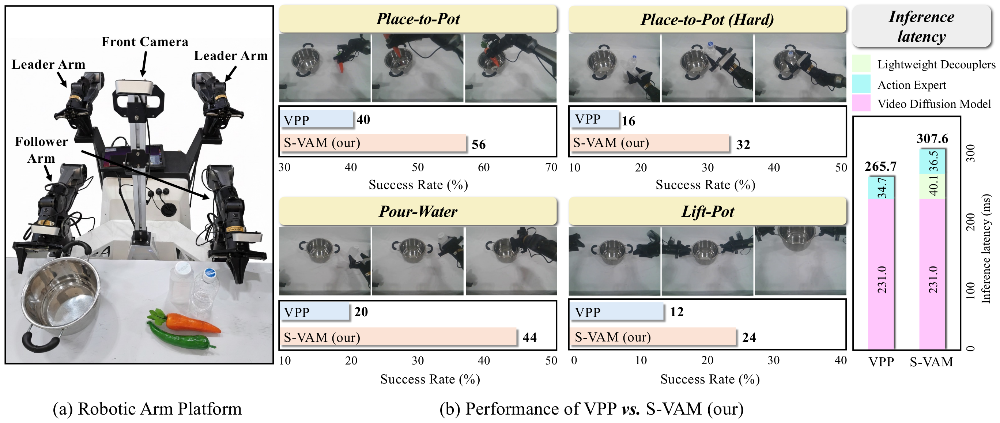

# S-VAM：兼顾实时性与前瞻性的 Video-Action Model 新探索

论文已上线 arXiv，代码后续开源。

如何让机器人既能高效决策，又能真正“看懂”接下来会发生什么？

这是视频-动作模型（Video-Action Model, VAM）近年来持续被关注的核心问题。近期，我们提出了 **S-VAM（Shortcut Video-Action Model）**，尝试回答一个关键挑战：**能否在不牺牲实时性的前提下，为机器人提供高质量的未来表征，从而真正帮助复杂操作任务中的动作预测？**

S-VAM 的核心思路，是为未来表征建立一条“捷径”。它不再依赖耗时的多步视频生成来获得前瞻信息，也不止步于直接使用噪声较重、耦合严重的单步扩散特征，而是通过一种自蒸馏机制，在一次前向传播中直接预测出具有清晰几何结构与语义信息的未来表征。基于这些前瞻表征，机器人可以更稳定、更准确地完成复杂操作任务。

在 CALVIN、MetaWorld 以及真实世界实验中，S-VAM 均取得了显著性能提升，并在单目第三人称这一更具挑战性的设定下展现出较强的实用潜力。

<em>图 1：S-VAM 的问题动机与整体思路。现有 VAM 要么依赖耗时的多步视频生成，要么直接使用噪声较大的单步特征；S-VAM 通过一条捷径，在单次前向中预测更清晰的几何与语义未来表征。</em>

## 为什么现有 VAM 还不够？

视频-动作模型之所以受到关注，一个重要原因在于它为机器人提供了 **visual foresight** 的能力。相比只基于当前观测直接预测动作，VAM 试图先理解“未来可能会发生什么”，再将这种前瞻信息用于动作决策。因此，它在复杂操作任务中展现出很强的潜力。

但现有路线普遍面临一个难以回避的矛盾。

一类方法依赖多步视频生成，能够预测较高保真的未来物理状态，但多步去噪过程带来的推理延迟较大，很难满足机器人高频闭环控制对实时性的要求。另一类方法尝试直接使用单步去噪中的中间特征。它们推理效率更高，但这些特征通常噪声较重、语义和几何信息高度纠缠，缺乏稳定、清晰的结构化先验，最终会影响下游动作预测的准确性。

对于机器人来说，这种问题尤其明显。仅仅知道“前方有一个目标物体”是不够的，模型还需要更清楚地理解它的局部结构、空间关系和可能的动态变化，才能做出准确、稳定的动作。

换句话说，当前 VAM 的关键瓶颈并不只是“能不能生成未来”，而是：**能否以足够高效的方式，为动作预测提供真正有用的未来表征。**

## S-VAM 做了什么？

围绕上述问题，我们提出了 **S-VAM（Shortcut Video-Action Model）**。顾名思义，它的目标并不是完整重走多步视频生成过程，而是建立一条从当前观测通往高质量未来表征的“捷径”。

S-VAM 的核心做法可以概括为三点。

### 1. 从一步特征出发，但不直接使用它

扩散模型在单步去噪时已经隐含了大量关于未来的信息，但这些信息往往是纠缠且带噪的。我们并不直接把这类特征交给动作专家，而是进一步对它们进行结构化提炼。

### 2. 用扩散模型自己生成的高质量未来，反过来监督高效前向

在训练阶段，我们利用扩散模型自身多步生成的高质量未来视频作为参考，从中提取 **DPAv3** 提供的动态几何结构信息，以及 **DINOv2** 提供的 patch-level 精细语义特征。

这些表征共同构成教师信号。随后，我们设计轻量级解耦器作为学生网络，学习在一次前向传播中，直接将单步特征映射到更清晰、更稳定的几何与语义目标空间中。

这种训练方式的关键在于：**把原本存在于多步生成过程中的结构化生成先验，压缩进单次推理中。**

### 3. 用解耦后的未来表征，帮助动作预测更稳定

通过上述方式，S-VAM 得到的不再是噪声较重、难以解释的中间特征，而是更具几何一致性和语义辨识度的未来表征。它们可以作为一个稳定的“未来蓝图”，帮助下游动作模块更准确地关注任务相关目标，并做出更可靠的控制决策。

<em>图 2：S-VAM 的方法框架。模型利用轻量级解耦器，将单步扩散特征映射到结构化的几何与语义目标空间，并将这些前瞻表征聚合后用于下游动作预测。</em>

## 实验结果说明了什么？

为了更充分地验证方法有效性，我们在 **CALVIN**、**MetaWorld** 以及真实世界平台上进行了系统实验，并刻意采用了更具挑战性的设定，例如 **单目第三人称视角**。这一设定天然存在深度缺失、遮挡和空间歧义等问题，因此更能考验模型对未来表征的建模能力。

实验结果表明，S-VAM 在多个场景下都带来了明显收益。

在 **CALVIN** 上，S-VAM 在多步长任务成功率和平均完成长度上取得了最优或接近最优的表现。在 **MetaWorld** 上，S-VAM 在中等和高难度任务上展现出更明显优势，整体平均成功率达到最佳。在 **真实世界实验** 中，S-VAM 在四项任务上均显著优于对比方法，同时保持了实时控制能力。

更重要的是，定性结果显示，S-VAM 学到的未来表征能帮助模型形成更连贯的注意轨迹，更稳定地聚焦任务相关物体，从而减少动作偏差与抓取失败。

<em>图 3：S-VAM 的真实世界多任务实验结果。仅基于单目第三人称视觉输入，S-VAM 依然在多项任务上显著优于对比方法，并保持了实时控制能力。</em>

## 我们还得到了一些有价值的 insight

除了性能提升之外，我们也进一步分析了：**什么样的视觉基础表征，更适合作为 S-VAM 的蒸馏目标？**

实验给出了两个很有代表性的结论。

第一，语义目标上，Dense Feature 优于 Global Feature。与 CLIP、SigLIP 这类 global-level 语义表征相比，**DINOv2 的 patch-level 特征效果更好**。原因在于机器人操作不仅需要理解“场景里有什么”，更需要细粒度地理解“目标物体具体在哪里、边界如何、应该如何接触”。

第二，几何目标上，Dynamic Geometry 优于 Static Geometry。相比静态几何先验，**DPAv3 这类动态几何表征更适合物理交互场景**。机器人面对的是时空持续变化的操作过程，因此对动态结构的建模能力尤为关键。

这些观察也说明，适合机器人操作的前瞻表征，并不是越大越通用越好，而是要真正贴近交互过程中的细粒度语义与动态几何需求。

## 最后

如何高效地从视频生成模型中提取对机器人操作真正有价值的前瞻先验，是 Video-Action Model 方向中的一个关键问题。

S-VAM 提供了一种可能的答案：**在视频-动作范式中，推理效率与前瞻保真度并非不可兼得。** 通过构建面向未来表征的“捷径”，我们可以在一次前向传播中得到更稳定、更清晰、更适合动作预测的几何与语义先验。

我们也期待这套思路能够进一步扩展到更多主流 VAM 架构中，作为一种高效、可插拔的模块，为机器人学习社区带来更多启发。

欢迎交流，也欢迎关注我们的后续工作。

## 相关链接

- 论文标题：S-VAM: Shortcut Video-Action Model by Self-Distilling Geometric and Semantic Foresight
- arXiv：https://arxiv.org/abs/2603.16195
- 项目主页：https://haodong-yan.github.io/S-VAM/
- 代码仓库：https://github.com/Haodong-Yan/S-VAM-Code
